# Canvas動作シーケンス図
## お絵描きプレイヤーが線を描く（基本フロー）

```mermaid
sequenceDiagram
    participant User as 👤 お絵描き
    participant Canvas as 🎨 Canvas Controller
    participant Server as 🖥️ GameChannel
    participant Others as 👥 他プレイヤー

    Note over User,Others: マウスを押す
    User->>Canvas: mousedown
    Canvas->>Canvas: isDrawing = true

    Note over User,Others: マウスを動かす
    User->>Canvas: mousemove

    par ① ローカル描画（即座）
        Canvas->>Canvas: drawLine(lastPoint, currentPoint)
        Note over Canvas: 自分の画面に<br/>すぐ表示
    and ② WebSocket送信
        Canvas->>Server: perform('draw', { from, to })
        Server->>Others: broadcast('draw')
        Others->>Others: drawLine(from, to)
        Note over Others: 他の人の画面にも表示<br/>
    end

    Note over User,Others: マウスを離す
    User->>Canvas: mouseup
    Canvas->>Canvas: isDrawing = false
```



```
ユーザー操作 (mousedown/mousemove/mouseup)
    ↓
Stimulusメソッド呼び出し (data-action)
    ↓
① ローカル描画（即座）
    ↓
② WebSocket送信（並行）
    ↓
③ 他プレイヤーに描画
```
