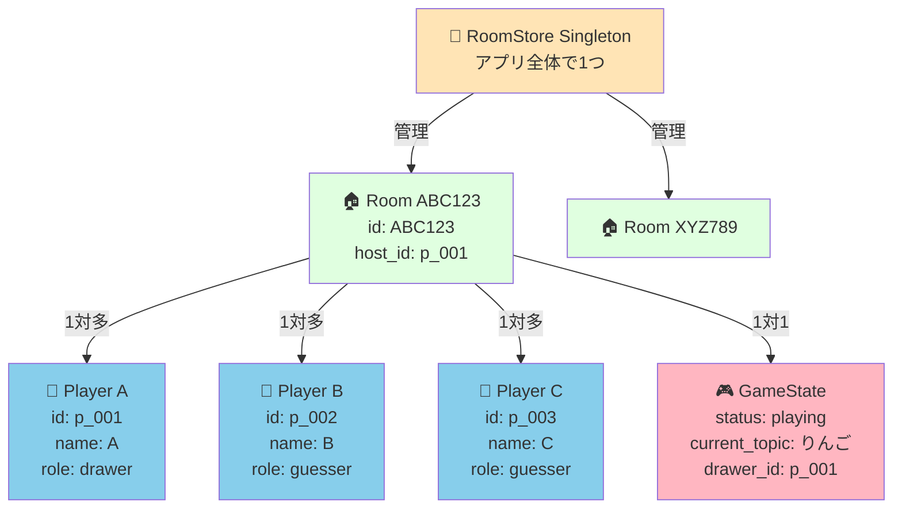

# モデル構造図 - お絵描きクイズゲーム

Railsアプリのモデル層（状態管理）の構造と関係性を図解

---

## 全体構造図



---

## 1. RoomStore（ルーム管理）

### 役割
- アプリ全体でルームを一元管理
- シングルトンパターン（1つのインスタンスのみ）

---

## 2. Room（個別ルーム）

### 役割
- プレイヤーを管理
- ゲーム状態を保持
- ホスト管理

---

## 3. Player（プレイヤー）

### 役割
- プレイヤー情報を保持
- 役割（お絵描き/回答）を管理

---

## 4. GameState（ゲーム状態）

### 役割
- ゲームの進行状態を管理
- お題とお絵描き役を保持
- ステートマシンパターン

```

## まとめ

### モデル構造の階層

```
RoomStore (Singleton)
  └── Room (複数)
       ├── Player (複数)
       └── GameState (1つ)
```

### 関係性

- RoomStore -(1対多)→ Room: 全ルームを管理
- Room -(1対多)→ Player: ルーム内のプレイヤーを管理
- Room -(1対1)→ GameState: ゲーム状態を保持
