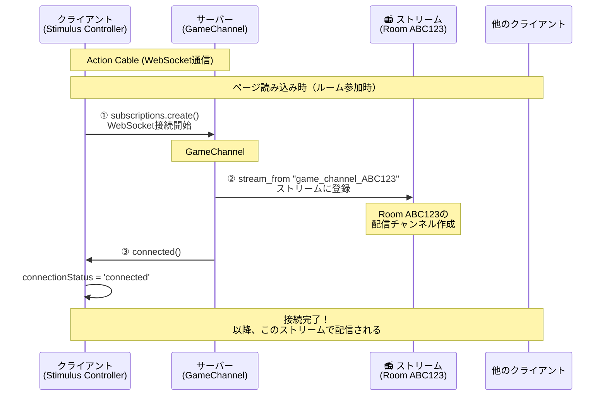
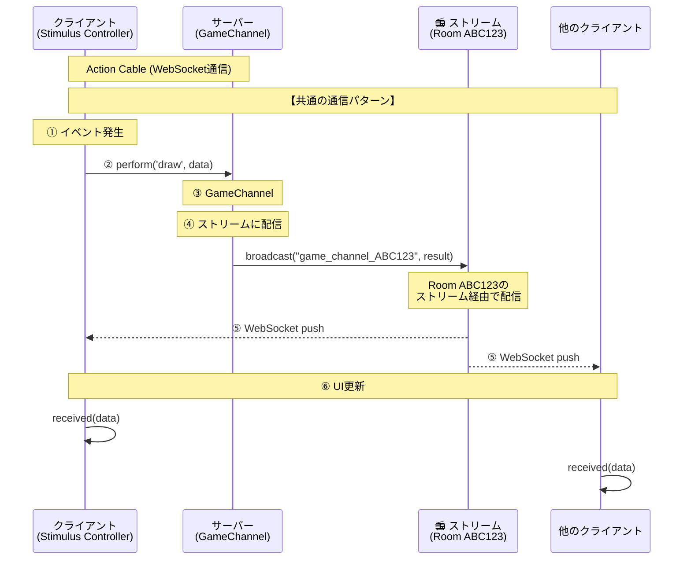
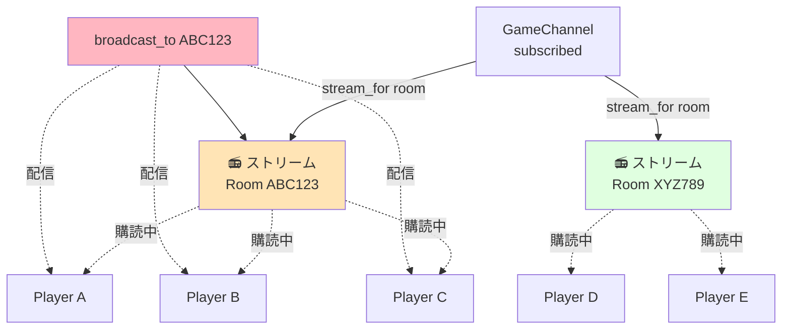

# リアルタイム通信
Action Cable（WebSocket）を使ったリアルタイム通信の動作フロー

---

## 1. WebSocket接続の確立（1回だけ、準備）

**何をしている？**
- プレイヤーがルームに参加した時、ブラウザとサーバーをWebSocketで接続
- サーバーは「ルームABC123専用のストリーム（配信チャンネル）」にこのプレイヤーを登録
- これで、ルームABC123で起きた出来事（描画、チャット等）が自動的にこのプレイヤーに配信される



---

## 2. 共通の通信パターン（すべてのイベントで同じ、通信のたびに何度も行う）

**何をしている？**
- プレイヤーがアクション（描画、チャット等）を行うと、WebSocket経由でサーバーに送信
- サーバーは処理を実行し、結果を「ルームのストリーム」にブロードキャスト
- ストリームに登録されている全プレイヤーに自動配信され、各自のUIが更新される



**ポイント:** Canvas描画、チャット、プレイヤー参加、ゲーム状態など、**すべてのイベントがこの同じ流れ**で処理されます。違うのはデータの中身（`data.type`）だけです。

---

## ストリームとは？

**ストリーム = ルーム専用の配信チャンネル（放送局のようなもの）**



---

## まとめ

### Action Cableの基本フロー
```
【図1: 接続確立（1回）】
接続確立 (subscribed)
    ↓
📻 ストリーム登録 (stream_for room)  ← ここで放送局に加入
    ↓
接続完了

【図2: 通信パターン（何度も）】
イベント送信 (perform)
    ↓
サーバー処理 (GameChannel)
    ↓
📻 ストリームに配信 (broadcast_to)  ← ここで放送局経由で配信
    ↓
全プレイヤー受信 (received)
    ↓
UI更新
```

### ルーム分離の仕組み
```
GameChannel
  └── stream_for room
       ├── Room ABC123 (独立したストリーム)
       │    ├── Player A
       │    ├── Player B
       │    └── Player C
       └── Room XYZ789 (独立したストリーム)
            ├── Player D
            └── Player E
```

### パフォーマンス特性
```
Action Cable:
  - レイテンシ: 50-200ms (中程度)
  - 適用範囲: チャット、状態同期、通知
  - 制約: 高頻度更新は不得意

Socket.io:
  - レイテンシ: 10-50ms (低い)
  - 適用範囲: リアルタイムゲーム、描画同期
  - 制約: 別サーバーが必要
```

### ステートマシンとの連携
```
GameState (モデル層)
  status: :waiting → :playing → :finished
          ↓          ↓          ↓
    broadcast  broadcast  broadcast
          ↓          ↓          ↓
    Action Cable で全プレイヤーに配信
          ↓          ↓          ↓
    全員のUIが同じ状態に更新される
```
