# リアルタイム通信シーケンス図

Action Cable（WebSocket）を使ったリアルタイム通信の動作フロー

---

## 1. WebSocket接続の確立（1回だけ、準備）

```mermaid
sequenceDiagram
    participant Client as クライアント<br/>(Stimulus)
    participant Cable as Action Cable
    participant Server as サーバー<br/>(GameChannel)
    participant Stream as 📻 ストリーム<br/>(Room ABC123)
    participant Others as 他のクライアント

    Note over Client,Others: ページ読み込み時（ルーム参加時）

    Client->>Cable: ① subscriptions.create()<br/>WebSocket接続開始
    Cable->>Server: ② 接続リクエスト

    Server->>Stream: ③ stream_for room<br/>ストリームに登録
    Note over Stream: Room ABC123の<br/>配信チャンネル作成

    Server->>Cable: ④ 接続成功
    Cable->>Client: ⑤ connected()
    Client->>Client: connectionStatus = 'connected'

    Note over Client,Others: 接続完了！<br/>以降、このストリームで配信される
```



---

## 2. 共通の通信パターン（すべてのイベントで同じ、通信のたびに何度も行う）

```mermaid
sequenceDiagram
    participant Client as クライアント<br/>(Stimulus)
    participant Cable as Action Cable
    participant Server as サーバー<br/>(GameChannel)
    participant Stream as 📻 ストリーム<br/>(Room ABC123)
    participant Others as 他のクライアント

    Note over Client,Others: 【共通の通信パターン】

    Note over Client: ① イベント発生
    Client->>Cable: ② perform('action', data)
    Cable->>Server: ③ WebSocket送信

    Note over Server: ④ サーバー側処理
    Server->>Server: ビジネスロジック実行

    Note over Server: ⑤ ストリームに配信
    Server->>Stream: broadcast_to(room, result)
    Note over Stream: Room ABC123の<br/>ストリーム経由で配信
    Stream->>Cable: ⑥ 配信
    Cable->>Client: WebSocket受信
    Cable->>Others: WebSocket受信

    Note over Client,Others: ⑦ UI更新
    Client->>Client: received(data)
    Others->>Others: received(data)
```



**ポイント:** Canvas描画、チャット、プレイヤー参加、ゲーム状態など、**すべてのイベントがこの同じ流れ**で処理されます。違うのはデータの中身（`data.type`）だけです。

---

## ストリームとは？

**ストリーム = ルーム専用の配信チャンネル（放送局のようなもの）**

```mermaid
flowchart TD
    GameChannel[GameChannel<br/>subscribed]

    Stream1[📻 ストリーム<br/>Room ABC123]
    Stream2[📻 ストリーム<br/>Room XYZ789]

    A[Player A]
    B[Player B]
    C[Player C]

    D[Player D]
    E[Player E]

    GameChannel -->|stream_for room| Stream1
    GameChannel -->|stream_for room| Stream2

    Stream1 -.購読中.-> A
    Stream1 -.購読中.-> B
    Stream1 -.購読中.-> C

    Stream2 -.購読中.-> D
    Stream2 -.購読中.-> E

    Note1[broadcast_to ABC123]
    Note1 --> Stream1
    Note1 -.配信.-> A
    Note1 -.配信.-> B
    Note1 -.配信.-> C

    style Stream1 fill:#FFE4B5
    style Stream2 fill:#E0FFE0
    style Note1 fill:#FFB6C1
```



### コードで見るストリーム

```ruby
# GameChannel (サーバー側)
class GameChannel < ApplicationCable::Channel
  def subscribed
    room = RoomStore.instance.find_room(params[:room_id])

    # ← ここでストリームに登録
    stream_for room  # Room ABC123 専用のストリームを作成

    # このストリーム経由で配信されるデータを受信できるようになる
  end

  def draw(data)
    room = RoomStore.instance.find_room(params[:room_id])

    # ← ここでストリームに配信
    GameChannel.broadcast_to(room, {
      type: 'draw',
      draw_data: data['draw_data']
    })
    # ↑ Room ABC123 のストリーム購読者全員に配信される
  end
end
```

---

## まとめ

### Action Cableの基本フロー
```
【図1: 接続確立（1回）】
接続確立 (subscribed)
    ↓
📻 ストリーム登録 (stream_for room)  ← ここで放送局に加入
    ↓
接続完了

【図2: 通信パターン（何度も）】
イベント送信 (perform)
    ↓
サーバー処理 (GameChannel)
    ↓
📻 ストリームに配信 (broadcast_to)  ← ここで放送局経由で配信
    ↓
全プレイヤー受信 (received)
    ↓
UI更新
```

### ルーム分離の仕組み
```
GameChannel
  └── stream_for room
       ├── Room ABC123 (独立したストリーム)
       │    ├── Player A
       │    ├── Player B
       │    └── Player C
       └── Room XYZ789 (独立したストリーム)
            ├── Player D
            └── Player E
```

### パフォーマンス特性
```
Action Cable:
  - レイテンシ: 50-200ms (中程度)
  - 適用範囲: チャット、状態同期、通知
  - 制約: 高頻度更新は不得意

Socket.io:
  - レイテンシ: 10-50ms (低い)
  - 適用範囲: リアルタイムゲーム、描画同期
  - 制約: 別サーバーが必要
```

### ステートマシンとの連携
```
GameState (モデル層)
  status: :waiting → :playing → :finished
          ↓          ↓          ↓
    broadcast  broadcast  broadcast
          ↓          ↓          ↓
    Action Cable で全プレイヤーに配信
          ↓          ↓          ↓
    全員のUIが同じ状態に更新される
```
