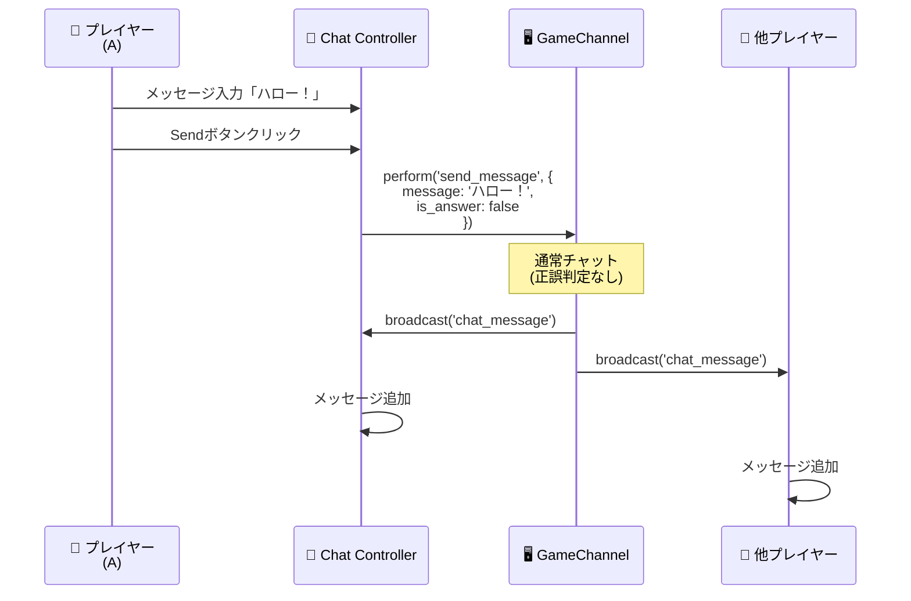
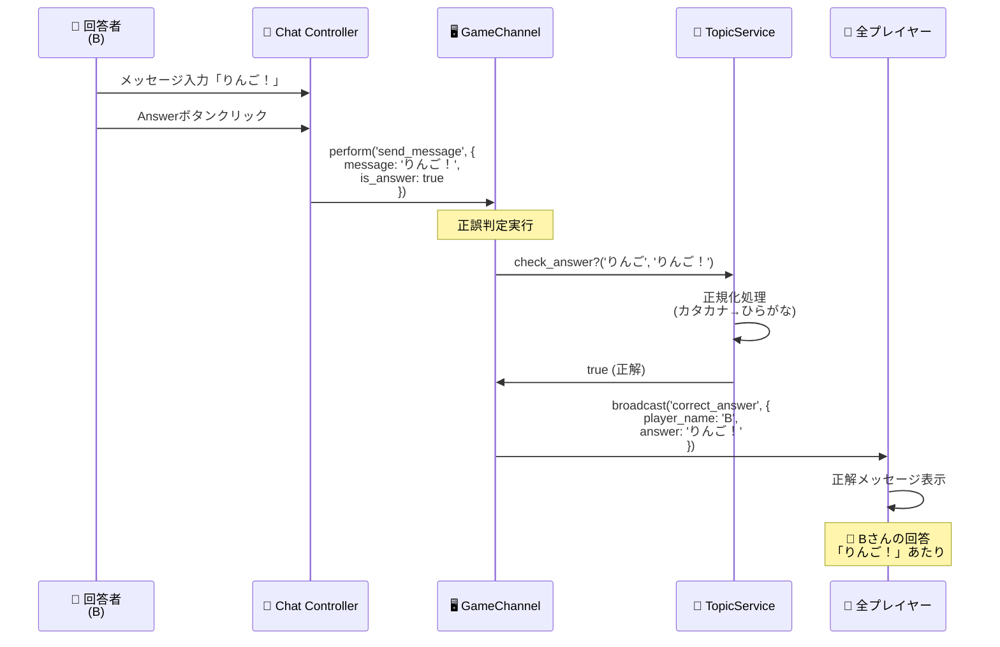
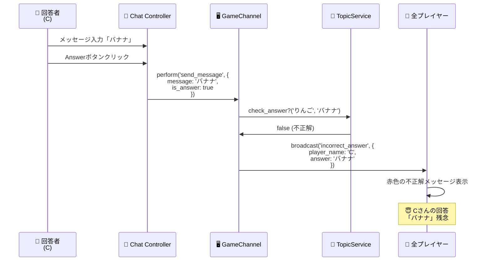

# チャット機能シーケンス図

Stimulusコントローラーを使ったチャット機能と正誤判定のリアルタイム動作フロー

---

## 1. 通常チャット送信（基本フロー）



---

## 2. 回答送信と正誤判定



---

## 3. 不正解の場合



## まとめ

### 基本フロー
```
メッセージ入力
    ↓
Send / Answer ボタンクリック
    ↓
WebSocket送信 (is_answer フラグで分岐)
    ↓
サーバー側で処理
    ├─ 通常チャット → そのままブロードキャスト
    └─ 回答 → 正誤判定 → 結果をブロードキャスト
    ↓
全プレイヤーにメッセージ表示
```
